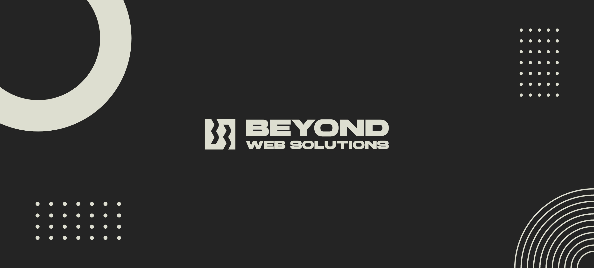

Welcome to Beyond Web Solutions' GitHub organization! We specialize in developing custom software solutions, primarily focusing on web applications that elevate our clients' digital presence.

## 🧑🏻‍💻 About Us
Beyond Web Solutions is dedicated to creating efficient, scalable, and innovative software solutions. We work closely with our clients to transform their vision into a high-quality software product, with services that cover everything from design to deployment and maintenance.

## 🔧 Technologies & Tools

## Connect with Us
For more information, check out our website or reach out on LinkedIn.

- [LinkedIn](https://www.linkedin.com/company/beyond-web-solutions-nl)
- [Website](https://www.beyond-web.com)
---

> © 2024 Beyond Web Solutions. All rights reserved.
